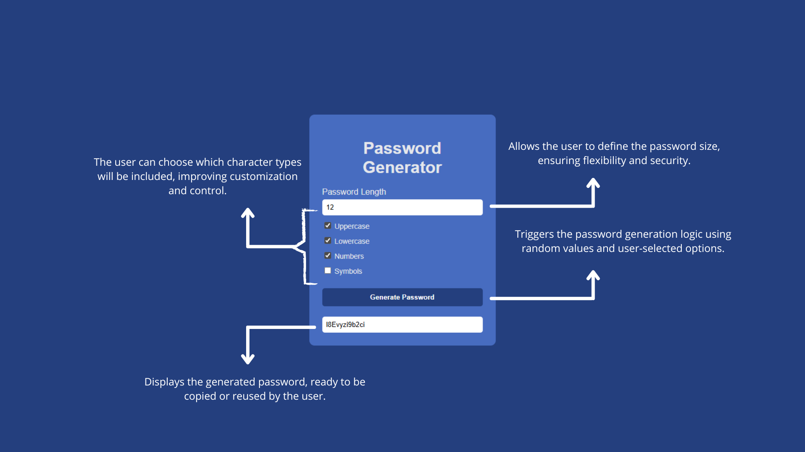

# 🔐 Password Generator

A simple, modern and secure password generator built with **HTML, CSS and JavaScript**.  
Users can generate strong random passwords or choose their own preferences.

🔗 Live Demo: https://imnayzinhaa.github.io/password-generator/

---

## ✨ Features

- Random password generation
- Custom password length
- Option to include:
  - Uppercase letters
  - Lowercase letters
  - Numbers
  - Symbols
- Clean and responsive interface
- Secure and customizable passwords

---

## 📸 Project Preview

---

## 🛠️ Technologies Used

- HTML5  
- CSS3  
- JavaScript (Vanilla)

---

## 🚀 How to Use

1. Select the password length
2. Choose which character types to include
3. Click **Generate Password**
4. Copy and use your secure password 🔒

---

## 📂 Project Structure

